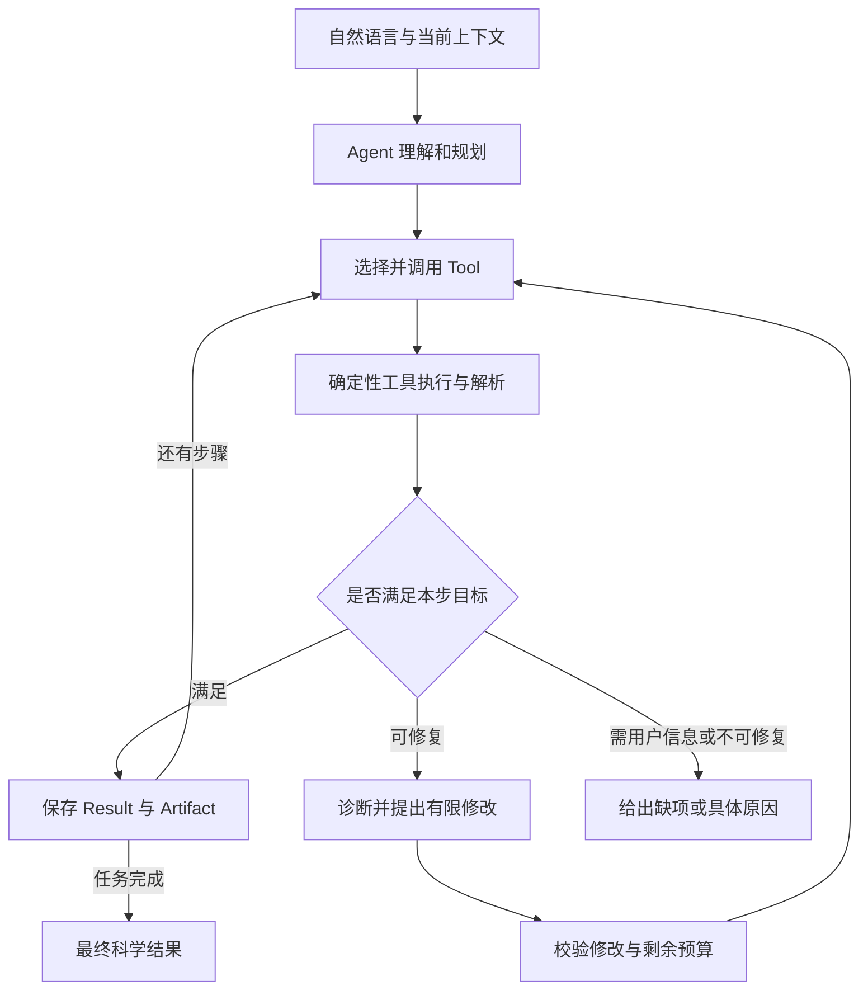

# BG6022-v3 迁移重建方案：以 Agent 计算与自动修复为核心

版本：2.0（按本轮原则重写，替代上一版迁移方案）
目标目录：`E:\BG6022-v3`
代码核对日期：2026-09-10

> BG6022-v3 是一个以自然语言驱动、由 LLM 规划、由确定性科学工具执行、能够自动诊断和修复计算任务的 ORCA Agent。
>
> 第一验收原则：**Agent 真的会做计算，包括遇到可修复失败时继续完成任务。**

本文件规定接下来要实现的行为，不表示已经在你的电脑上完成重建或真实计算验收。

## 1. 本版作出的架构决定

采用 **一个 Agent 主循环 + 可组合 Tool + LLM 规划/诊断 + 确定性 ORCA 适配器**。对话、调用工具、检查结果、修复和继续执行在一条调用链中完成。

与上一版相比，实质替换四项设计：

| 上一版安排 | 本版实施要求 |
|---|---|
| 身份和几何准备固定放在 Plan 外 | `resolve_molecule`、`generate_geometry` 进入工具目录，由 Planner 按输入与历史产物选择 |
| 首版 ORCA 自动重试为 0 | 首个可用版本默认启用经过验证的有界修复 |
| 先验收普通成功流程，后期完善修复 | 首个自然语言计算版本就验收失败→诊断→修复→继续→结果 |
| 将准备、草稿、执行状态拆成较多独立层 | 保持七个领域对象，参数与诊断作为对象字段，减少协调模块 |

仍保留科学正确性、取消、预算和原始输出。这些作为工具与少量文件操作的要求实现，不先建设事件溯源、数据库迁移或通用工作流平台。

### 1.1 不变的工程边界

- Runtime 领域对象仅有：`Request / Plan / Step / Tool / Run / Result / Artifact`。
- `M0/M1/M2…` 只用于 docs、Issue、tag 和开发里程碑，不进入源码文件名、领域类或产品状态。
- `Workflow` 就是一组 Step 对 Tool 的组合，不建立 `OPT_FREQ_SP_PROTOCOL`。
- 首版 Windows、本地 ORCA、DeepSeek、PubChem→SMILES→RDKit→XYZ。
- 资源默认 **4 核、总内存 2048 MB、每进程 MaxCore 384、真实并发 1**。
- v2 原仓库与结果保留；v3 独立环境、包和运行目录，不导入 v2 执行数据库。

## 2. 实际参考基线与取舍

本轮通过 GitHub 重新核对：

| 对象 | 提交 |
|---|---|
| TritonDFT main | `d9ac1ee5035baa07bf36a5cdc8a0f7c12bc21d79` |
| BG6022-v2 `codex/v2-p7-chat-entry-repair` | `89f69de430ab4e42cc0cca3fc5798612eafdad82` |
| BG6022-v2 main | `c64f547956f9ede2c0db02757199d1e2c0dc86f0` |

迁移主要参考修复分支，不能把 main 与修复分支当成同一份代码。本地未提交修改另作核对，不需要先清理或合并 v2 才能开始新 v3。

### 2.1 TritonDFT 值得借鉴的实现

Triton 的主 Agent 有计划生成、单步工具执行、输入校验、结果反馈和有限参数重试。`DFTAgent.py` 中单步循环限制为 3 次，并将失败反馈用于生成下一次参数；这是本版自动修复的参考。外层执行仍主要是顺序遍历，v3 要补上从当前 Plan 重新选择步骤的循环。[Triton Agent](https://github.com/Leo9660/TritonDFT/blob/d9ac1ee5035baa07bf36a5cdc8a0f7c12bc21d79/src/DFTAgent.py)

| Triton 代码 | 借鉴内容 | v3 落点 |
|---|---|---|
| `DFTAgent.py` | 一条“计划—执行—反馈—修复”调用链 | `agent.py` |
| `prompt/planner.py` | 根据工具能力分解计算任务 | `planner.py`、`prompts/planner.md` |
| `tool/tool_map.py` | 集中的工具说明与注册 | `tools/registry.py` |
| 单步反馈与 `new_param_guess` | 依据失败调整参数再执行 | `repair.py` + 工具自己的修复选项 |
| `workflow_state.py` | 简单结果保存、上游改变后使后续结果失效 | `session.py` 与 Plan 的引用处理函数 |

Triton 的主要 DFT 工具面向 Quantum ESPRESSO，其主 Agent 也已有约 2,008 行。因此借鉴短调用链和工具组织，使用分子 ORCA 的输入与结果模型；不复制 QE 的晶胞/赝势逻辑，不以 LLM 判断代替科学数值解析。[工具注册](https://github.com/Leo9660/TritonDFT/blob/d9ac1ee5035baa07bf36a5cdc8a0f7c12bc21d79/src/tool/tool_map.py)、[工作流状态](https://github.com/Leo9660/TritonDFT/blob/d9ac1ee5035baa07bf36a5cdc8a0f7c12bc21d79/src/workflow_state.py)

## 3. 最终产品流程



对于 ORCA Tool，内部固定调用：**解析参数和输入引用 → 生成合法 `.inp` → 启动 ORCA → 读取原始输出 → 返回 Result**。模型决定做什么和允许范围内如何调整；工具负责实际怎么正确执行。

对于普通问答，直接生成回答；对于会话结果查询，先读取对应 Result 再回答。这两条分支不制造计算 Plan。

### 3.1 确认保持短且可配置

沿用此前“默认参数先展示供确认”的偏好，默认在第一次启动 ORCA 前确认一次。当时分子解析和几何 Tool 已提供真实身份/坐标，界面展示完整参数、步骤、预算与自动修复范围。

确认不是新领域对象或独立审批服务，只是 `Run` 中的执行许可。第一次 ORCA 前，将真实分子、已解析参数、已存在的几何引用、Plan 和修复范围绑定为当前接受版本。未来产物绑定的是明确依赖关系，不要求预先存在。用户修改这些内容后原接受失效；用户确认后的数值修复在已接受范围内自动进行，不每次询问。

配置 `confirm_before_compute = false` 可用于明确选择的自动执行模式：在既定工具、参数政策和预算内直接执行。分子歧义、电子态不明确等真实缺项仍需澄清。模型不能自行把这个配置改为 false。

## 4. 七个领域对象足够

| 对象 | 内容 | 不承担的职责 |
|---|---|---|
| `Request` | 用户原文、任务目标、显式参数、所需结果、会话引用 | 不携带旧阶段 schema 和执行状态 |
| `Plan` | Step 列表、目标输出、计划修订 | 不绑定一个固定三步协议 |
| `Step` | 工具名、参数、输入引用、目标检查 | 不自己管理 ORCA 进程 |
| `Tool` | 参数/产物定义、执行函数、成功判据、可用修复选项 | 不管理对话与数据库 |
| `Run` | 当前 Plan、步骤进度、尝试记录、预算、执行许可 | 不演化成通用 Kernel |
| `Result` | 成功或失败事实、数值、科学检查、诊断、产物引用 | 不隐藏失败，也不生成虚构数值 |
| `Artifact` | 分子结构、XYZ、输入、输出、Hessian 等文件或结构化产物及来源 | 不把未收敛几何自动认作成功优化结构 |

工具参数可以有局部 Pydantic 类型，诊断可以有错误枚举；它们不是新增长期领域对象，也不需要各自一套 Service/Repository/Record。

LLM 输出意图、参数建议、步骤逻辑标签和可用产物引用。程序生成持久化 ID、文件路径、hash、版本和运行状态。不要让模型填写 `ready`、`approved`、`running` 决定是否计算。

## 5. 推荐代码结构

按实际功能逐个加入文件，不在起步时创建空框架。以下目录中不存在运行时阶段命名。

```text
E:\BG6022-v3\
  start_chat.cmd
  start_chat.py
  pyproject.toml
  uv.lock
  config.example.toml
  README.md
  AGENTS.md
  .gitignore
  .gitattributes
  .github/workflows/offline.yml
  src/bg6022/
    __init__.py
    __main__.py
    cli.py
    agent.py
    models.py
    planner.py
    repair.py
    llm.py
    answer.py
    session.py
    config.py
    tools/
      __init__.py
      registry.py
      molecule.py
      pubchem.py
      orca.py
    orca/
      __init__.py
      profiles.py
      input.py
      runner.py
      windows_job.py
      parser.py
      checks.py
      repair_rules.py
    prompts/
      intake.md
      planner.md
      repair.md
      answer.md
  tests/
    unit/
    integration/
    live/
    fakes/
    fixtures/
  docs/
    migration.md
    architecture.md
    acceptance.md
```

关键分工：

- `agent.py`：唯一 Agent 类和主循环，协调理解、规划、工具、修复、回答。首版不另造通用 executor 平台。
- `planner.py`：生成/修订 Plan，检查引用和用户要求；工具列表来自注册表。
- `repair.py`：将失败事实、历史尝试和工具可用修复选项交给同一 LLM，得到修改建议。
- `tools/registry.py`：装配 Tool，验证参数/输出定义、生成模型可读目录；不另维护一份白名单。
- `tools/molecule.py`：实现 `resolve_molecule`、`generate_geometry`；网络细节委托 `pubchem.py`。
- `tools/orca.py`：实现 Opt/SP/Freq 三个薄工具，共用 ORCA 输入、运行和解析代码。
- `orca/repair_rules.py`：ORCA 修复动作及边界，不是 RepairKernel；其他工具有自己的局部修复规则。
- `session.py`：近期对话、Run JSON、产物索引和少量文件/锁操作。
- `answer.py`：选择科学结果，生成确定性数值部分与 LLM 说明。
- `cli.py`：组装 Agent、读输入、显示输出、处理命令；双击和命令行进入同一实现。

Planner、诊断和回答可以是同一个模型的不同调用，不要求三个独立 Agent 相互发消息。以后替换模型或增加工具都不应重写 ORCA runner。

## 6. Tool 接口与动态组合

### 6.1 首版五个工具

| Tool | 输入 | 主要输出 | 实现者 |
|---|---|---|---|
| `resolve_molecule` | 名称/CAS/CID/SMILES | molecule：规范结构、身份和结构事实 | PubChem/RDKit |
| `generate_geometry` | molecule | geometry：初始 XYZ 与结构来源 | RDKit |
| `optimize_geometry` | geometry、科学参数 | optimized_geometry、优化末态电子能 | ORCA |
| `single_point` | 明确 geometry、科学参数 | 独立 SP 电子能与已启用性质 | ORCA |
| `frequency` | 明确 geometry、科学参数 | 频率、Hessian、适用的科学检查 | ORCA |

显式 SMILES 可在 resolve 工具中直接验证，无需先查询 PubChem。用户提供可用 XYZ 或引用历史 Artifact 时，Plan 可以直接使用它，省略 resolve/generate。

Tool 要公开：名称、描述、参数模型、输入/输出端口、能提供的结果、执行函数、成功检查、修复选项和适用范围。接口概念如下：

```python
Tool(
    name="optimize_geometry",
    description="优化指定结构，返回优化几何与末态电子能",
    parameters=OptParameters,
    input_ports={"geometry": "molecular_geometry"},
    output_ports={"optimized_geometry": "molecular_geometry"},
    results={"opt_final_electronic_energy": "Eh"},
    execute=run_opt,
    check=check_opt,
    repairs=ORCA_OPT_REPAIRS,
)
```

参数和结果 schema 从相应模型生成，端口/结果元数据在注册时验证一致。可用性以当前安装和已验收实现为准，不把尚未实现的 Tool 放进可执行目录。

### 6.2 Plan 示例：优化水并输出能量

下面是 Planner 生成的语义计划，不包含由模型伪造的文件路径、UUID、hash 或运行状态：

```json
{
  "steps": [
    {
      "id": "molecule",
      "tool": "resolve_molecule",
      "inputs": {},
      "parameters": {"query": "水", "input_kind": "name"}
    },
    {
      "id": "geometry",
      "tool": "generate_geometry",
      "inputs": {"molecule": {"step": "molecule", "output": "molecule"}},
      "parameters": {}
    },
    {
      "id": "opt",
      "tool": "optimize_geometry",
      "inputs": {"geometry": {"step": "geometry", "output": "geometry"}},
      "parameters": {"method_profile": "r2scan3c", "environment": "gas"}
    }
  ],
  "requested_results": [
    {"step": "opt", "field": "opt_final_electronic_energy"},
    {"step": "opt", "field": "optimized_geometry"}
  ]
}
```

此时尚未执行 resolve，允许电荷与多重度尚未确定。工具执行提供结构事实后，程序解析缺省值并校验，首次 ORCA 执行前必须完整。缺省参数由政策解析；模型不填写假的“已验证电荷”。

### 6.3 请求不同，组合就不同

| 请求 | Plan |
|---|---|
| 优化水 | resolve → generate → optimize |
| 用初始结构计算单点 | 已提供结构：single_point；没有结构：resolve → generate → single_point |
| 优化后检查频率 | resolve → generate → optimize → frequency |
| 优化、频率、独立单点 | resolve → generate → optimize → frequency → single_point |
| 对刚才优化结果做 SP | single_point，直接引用指定 optimized_geometry |
| 只对给定结构求频率 | frequency，按该结构解释结果，不自动声称已验证极小点 |

用户只要求 Opt 时，不能因为“推荐完整流程”偷偷加 Freq/SP。用户要求自由能等尚未启用结果时，说明缺少什么能力，不用电子能替代。

### 6.4 输入引用必须明确

依赖由 `inputs` 的产物引用推导；无需让模型另写一份可能冲突的 `depends_on`。指定历史产物时，模型只能引用程序提供的逻辑名称，程序绑定真实 Artifact ID。

Opt→Freq→SP 中，Freq 与 SP 通常都使用该 Opt 的优化结构；SP 不应错误地寻找 Freq 生成的新 XYZ。若用户要求先确认极小点再做 SP，则 Plan 还应声明对应前置科学检查，不能只靠列表顺序暗示该要求。

计划校验分两次：

1. 执行工具前的结构校验：工具存在、参数字段合法、ID 唯一、引用无环、端口/结果存在、用户显式要求未被改写。
2. 每个工具调用前的具体校验：输入已实际产生、结构与电子态一致、科学参数完整、方法/环境/操作可用、预算足够。

这允许“先规划，执行中获取必要信息”，同时避免要求所有未来文件在计划生成时就存在。遗漏了几何生产者时把具体错误交回 Planner，有限修订；不要自动拼接一个隐藏的固定协议。

`ready` 不能只看磁盘上是否有 XYZ。正式输入引用必须绑定到生产者成功发布的端口、相容角色和所需科学检查；有明确前置目标时还要满足该目标。失败记录里的 restart_candidate 只允许被已验证的 Opt 重启动作消费，不能被正常后续步骤自动选中。

## 7. 自动诊断和修复是首版能力

### 7.1 修复链条

1. Tool 执行结束后收集进程事实、stdout/stderr、退出原因、相关收敛信息及产物。
2. 程序分类失败，保留证据，返回失败 Result；不是统一抛出一个无上下文异常。
3. 将失败事实、当前 Step、以前尝试、剩余预算和该 Tool 的修复选项交给 LLM。
4. LLM 选择一个允许的修复动作，提出参数修改或必要的计划调整。
5. 程序验证修改范围及科学条件；有效则重新生成输入并执行，无效则有限纠正或停止。
6. 本步成功后绑定新产物，继续后续步骤；不要求用户手工重开整个任务。

网络等明确瞬时失败可以由工具按规则直接重试。SCF/Opt 策略选择允许 LLM 参与；其建议必须落在工具声明的动作中。固定规则负责可执行边界，LLM 负责结合任务和证据选方案。

### 7.2 先修 v2 失败信息丢失的问题

现有 `parse_orca_output()` 主要解析成功任务；非零退出码会提前抛错，缺失 Opt 收敛标志也直接异常。只复制这个解析器再加 repair prompt，无法形成有效修复。

v3 在 `orca/parser.py` 中先实现 `inspect_attempt()`，收集成功或失败都可获得的事实；再调用正式结果解析与科学检查。失败 Result 至少包含：

- 错误类别、实际退出原因，以及有位置/来源的输出片段；
- 是否达到迭代上限、是否存在可解释的 SCF/Opt 进展；
- 已经执行的修复和当前参数；
- 存在时的最后完整、结构检查通过的 XYZ；
- 失败文件的 Artifact 引用。

没有证据时返回“原因未确定”，不能仅凭某个泛化错误码声称是 SCF 上限。正式结果的终止、收敛、能量与几何对应检查继续保留。[v2 解析器](https://github.com/az87988799/BG6022-v2/blob/89f69de430ab4e42cc0cca3fc5798612eafdad82/src/orca_agent/execution/orca_parser.py)

未收敛的完整 XYZ 可以登记为 Artifact，并标记 `role=restart_candidate`、适用于优化重启；它不是 `optimized_geometry`。Freq/SP 的正式后续步骤不能误取它作为已收敛优化结果。

### 7.3 第一批修复动作

| 失败事实 | 自动动作 | 启用要求 |
|---|---|---|
| PubChem 暂时超时/限流 | 同一查询有限重试，遵守限流等待与截止时间 | 不改变分子身份，不无限等待 |
| RDKit 嵌入失败 | 同一结构改用记录好的第二个 seed 或已验证嵌入选项 | 保留立体化学，最多有限尝试 |
| SCF 接近收敛但迭代用尽 | 增加 `%scf MaxIter` 后重跑当前 Step | 诊断支持该判断，保持原收敛精度与方法/电子态 |
| Opt 到达最大步数且有完整可用结构 | 用最后有效结构作初猜，提高限定优化步数后继续 Opt | 只生成 restart_candidate，后续仍需重新通过收敛判定 |
| 暂存输入文件缺失，但原 Artifact 完整 | 重新暂存并重建输入 | 不能从模型猜文件内容，不重复同一无变化错误 |

最小修复版本必须实现前两类工具恢复，以及 SCF 增加迭代/Opt 重启两种科学修复中的可验证策略；M1 的验收要求至少一条真实 ORCA 失败→自动修复成功的完整证据，另一类明确其已验证范围。不要仅靠假失败 Result 宣称真实修复完成。

对振荡/难收敛 SCF，后续加入按方法验证的 `SlowConv` 等收敛配置；TRAH 需检查目标方法和版本支持，不能机械地把每次失败都改成 TRAH。算法调整后仍需核对所得电子态与科学结果，收敛并不自动证明全局最低解。[ORCA SCF 设置](https://www.faccts.de/docs/orca/6.1/manual/contents/essentialelements/scf.html)

### 7.4 虚频如何处理

`frequency` 正常完成且有虚频时，计算结果是真实信息。如果用户只要求频率，直接报告；如果明确要求验证局部极小值，则标记“科学目标未满足”，进入适用的修复判断。

在小虚频、已验证模式布局和预算允许的范围，可增加一次“更紧优化 → 重新频率”策略。它需要：

- 使用一致的方法、基组、环境和电子态；
- 明确新的优化结构，重新绑定 Freq 和后续 SP；
- 保留旧几何的 Freq 结果，不把它覆盖成新结构结果；
- 若仍未满足，明确输出“尚未验证为极小值”；
- 用户只允许原结构 Freq 时，增加 Opt 属于范围变化，需要用户接受。

首版不承诺任意虚频都可自动消除。沿模位移、构象搜索和过渡态搜索以后作为新 Tool 接入，而不是在 repair.py 塞入未经验证的通用魔法。[ORCA 优化及虚频说明](https://www.faccts.de/docs/orca/6.1/manual/contents/quickstartguide/troubleshooting.html#imaginary-frequencies-after-optimization)

### 7.5 自动修复的边界

以下情况先诊断，不能为了让任务成功而自行改变问题：

- 不静默修改分子、总电荷、多重度、方法、基组、溶剂或用户显式约束。
- 不降低成功判定精度，不将未收敛数据标为成功。
- 不自动超出 4 核/2048 MB 的预算；OOM 不保证能靠改一个参数解决。
- 用户取消、期限耗尽、磁盘满、程序未安装或进程是否退出不明时，不盲目再启动。
- 输入生成器存在语法缺陷时，给出具体技术错误；模型不能现场改 Python 或随意编辑 `.inp` 来绕过编译器。
- 不支持的输出格式保留原文件，报告解析范围；不能让 LLM 猜数值填 Result。

这些边界属于“仍然在做用户要求的同一个计算”，不要求新增审批平台。

### 7.6 建议默认预算

| 预算 | 默认 |
|---|---:|
| 自动修复 | 开启 |
| 单个科学 Step 最大尝试 | 3 次，含首次执行 |
| 一个 Run 额外 ORCA 执行数 | 最多 3 次，含新插入的修复计算 |
| Plan 失败后自动修订 | 最多 2 次 |
| 每次结构化模型输出的格式纠正 | 最多 1 次 |
| 单次 ORCA 执行期限 | 1200 秒 |
| 一个 Run 主动执行累计期限 | 3600 秒，等待用户的时间不计入 |

这些是本项目建议默认值，不是 ORCA 固有限制。各次执行的实际期限还受剩余总期限限制。网络/LLM 调用也有独立有限超时，不能用等待模型拖成永久运行。

同一 Run 内新建 Step 或修订 Plan 不能重置已消耗预算。重试、为修复新增的 ORCA 步骤，以及上游改变后重算的后继，都计入额外 ORCA 次数；替换原失败步骤时继承其已用尝试次数，不能靠改 Step ID 获得新的三次机会。

相同输入、相同错误、没有有效改变时提前停止。科学参数为用户明确限定的最大迭代次数时，不擅自突破；自动调整范围在启动预览中列明。

### 7.7 修复后继续执行的核心循环

```python
while True:
    if all_requested_results_verified(run):
        return answer_from_current_results(run)
    if cancelled(run) or budget_exhausted(run):
        stop_run(run)
        break
    step = next_ready_step(run.plan, run.artifacts)
    if step is None:
        revision = propose_dependency_repair(run)
        if valid_revision_within_budget(revision, run):
            apply_plan_revision(run, revision)
            save_run(run)
            continue
        return ask_for_missing_input_or_report_plan_failure(run)
    if needs_execution_permission(step, run):
        return show_plan_and_wait(run)
    result = invoke_tool(step, run)
    save_attempt(run, step, result)
    if result.needs_user_input:
        return ask_and_pause_current_request(run, result)
    if meets_step_goal(step, result):
        bind_successful_outputs(run, step, result)
        continue
    proposal = diagnose_and_propose_repair(step, result, run)
    if not repair_is_allowed(proposal, run):
        return explain_failure_or_ask(run, result)
    apply_repair_to_current_plan(run, proposal)

return answer_with_partial_results_and_reason(run)
```

代码展示控制思路，实际实现须处理等待确认、输入补充、异常与线程取消。读取的是当前 Plan，不能用固定 `for step in plan.steps` 后在循环中重新赋值 plan 冒充动态重规划。

同一步重试产生新尝试；成功后输出端口指向成功的那次 Artifact。若插入新步骤或替换上游结构，必须一起更新相关 inputs、科学前置检查和 requested_results，使受影响的旧后续结果不再充当当前结果；无关成功步骤保留。修订后仍须覆盖原 Request 的目标，不能删除失败目标来宣称完成；失效的旧结果仅作为历史证据，不参与本次完成判定。

计划中途修订为可执行方案后继续当前循环；真正缺少用户信息时保存后返回输入；没有有效修改或修订次数用尽时明确结束。不要把所有这些分支都写成一个无条件 return，导致修复成功后仍无法继续计算。

## 8. 参数、结构和回答如何避免旧问题

### 8.1 参数只有一个合并入口

`Request` 记录用户明确参数；工具执行提供结构事实；`orca/profiles.py` 的小函数补齐适用默认，并输出唯一有效参数集合。来源用 `user / structure / default` 字段记录，不要求用户提交“原文依据”。

优先级：本轮明确修改 > 此 Request 此前显式要求 > 适用结构事实 > 默认政策。省略字段不清空历史值，charge=0 不能当缺失。修改分子后重新核对电子态和几何。

默认方法 `r2scan3c`、环境 gas。方法、环境分别注册，最终一起检查兼容性；profile 不拥有第二份资源预算。方法别名集中定义，不在多个服务里维护 `if/elif` 替换。

### 8.2 电荷与多重度

- 从明确结构读取形式电荷；不把所有分子默认成中性。
- 对已验证闭壳层范围推荐单重态；自由基、氧分子、金属和不明确电子态需进一步判断。
- 电子数奇偶性用于检查合法性，不能唯一决定多重度。
- 用户改总电荷时核对对应电子态，不能继续套用 v2 的“必须等于 SMILES 形式电荷”包装器。
- 输入 XYZ 本身通常不能确定完整化学身份、键级、电荷和自旋；缺项要从可靠上下文或用户获得。
- 几何 Tool 不偷偷为缺失多重度补 1。

科学参数尚缺时可以保存 Request 和不完整 Plan；只有执行所需参数完整时才启动相应 ORCA Tool。这样用户补充信息后能接着原任务继续。

### 8.3 对话与 LLM 输出

- 四类意图保留：化学计算、化学问答、日常问答、上下文查询。
- 普通问答走文本回答，不被要求填写计算 Plan 或状态字段。
- 当前 Request/Plan、近期消息、相关 Result 摘要进入上下文，不把整个历史 `.out` 全塞进去。
- 查询使用单独的小参数结构，不复用计算修改对象，避免 `output_patch` 流入查询入口。
- schema 从 Pydantic 类型生成，示例也用同一类型校验；语义验证要求同时写进提示词。
- 格式失败给具体字段和诊断编号，最多纠正一次；保留上一份合法 Request/Plan。
- `/confirm`、`确认`、`/cancel`、`/status`、`/new`、`/exit` 在相应状态直接由程序处理。
- 明确确认当前计划后不再调用 LLM 重新生成 Plan；“确认并改方法”先更新预览，不能先跑旧参数。

JSON 输出模式不替代业务校验；模型空响应、截断、认证错误、格式错误分别诊断。[DeepSeek JSON Output](https://api-docs.deepseek.com/guides/json_mode/)

### 8.4 结果由程序给事实，LLM 给解释

| 结果 | 输出规则 |
|---|---|
| Opt 电子能 | 标为优化末态电子能，保留方法与几何 |
| 独立 SP 电子能 | 仅来自明确独立 SP 任务 |
| 频率 | 保留单位 cm⁻¹、符号和模式范围，不抹去负值 |
| 极小点验证 | 根据适用方法/电子态/频率判据，允许未验证或范围不支持 |
| Gibbs/焓/ZPE | 对应解析、温压/标准态处理与 fixture 完成后才启用 |
| 失败任务 | 输出已完成的有效结果、未完成项、尝试过的修复和最后原因 |

ORCA 在 Opt 中出现 `FINAL SINGLE POINT ENERGY` 不意味着另做了独立 SP。单次 Opt 也不能保证找到了全局最低能量。

用户说“计算乙醇最低能量”时，提出当前支持的局部优化任务并说明范围；若用户明确要求全局搜索，而该 Tool 尚未实现，就指出缺少构象搜索能力，不能假装普通 Opt 已完成该目标。

## 9. ORCA 适配层的具体要求

### 9.1 输入与输出不能互相覆盖

每次尝试使用独立目录和固定 ASCII 文件名：

- `input.inp`：本次 ORCA 输入。
- `geometry.xyz`：本次初始几何，完成后原字节保持不变。
- `input.xyz`：Opt 生成的几何输出，按实际存在情况登记。
- `input.hess`：Freq 等操作的 Hessian，按实际存在情况登记。
- `stdout.out`、`stderr.txt`：原始输出，直接落盘。

示例输入：

```text
! r2SCAN-3c TightSCF Opt
%pal
  nprocs 4
end
%maxcore 384
* xyzfile 0 1 geometry.xyz

```

writer 保证末尾换行/空行。初始 XYZ 不能命名为 `input.xyz`，否则可能被 ORCA 依照 basename 生成的优化产物覆盖。

### 9.2 修复的是类型化参数

`orca/input.py` 接收已经解析的工具参数和几何引用，渲染方法、操作、收敛设置和数值上限。Repair 修改 `scf_maxiter`、`geom_maxiter`、已注册的 convergence profile 或明确的重启结构引用，再重新生成输入。

不接受模型提供任意 `.inp` 文本执行；不继续保留 v2 对 `basis|d4` 的全局字符串禁止规则。合法性由方法配置及字段定义判断，新语法在 ORCA 适配层实现并测试。

Opt 重启必须核对最后结构的原子顺序、坐标完整性、来源和该次尝试归属；不能把随机残留 XYZ 当重启点。最大优化步数和收敛控制都有官方设置，但适合哪个失败要由实际诊断确定。[ORCA 几何优化参数](https://www.faccts.de/docs/orca/6.1/manual/contents/structurereactivity/optimizations.html)

### 9.3 进程执行

- 用 ORCA 完整路径、`shell=False`，主程序外不再套 `mpirun`。
- 使用独立 cwd，stdout/stderr 直接写文件。
- 保留 Windows Job Object：进程树取消、退出清理、总内存边界。
- 子进程 OMP/MKL/OPENBLAS/NUMEXPR 线程变量限制为 1，不污染主进程环境。
- `%maxcore 384` 按每进程设置，不是总内存限制；4×384 留出余量，另由总进程限制约束 2048 MB。
- 超时、取消或程序状态不明确时，先处理已有进程，不能同时启动修复副本。

ORCA 官方明确 `%maxcore` 为每核心内存且可能被超出；当前预算用于小分子验证，不保证所有未来请求都能完成。[ORCA 启动与内存说明](https://www.faccts.de/docs/orca/6.1/manual/contents/quickstartguide/troubleshooting.html)

本版默认抽取 v2 的原生适配代码，不把安装 OPI 作为开工前置项。未来若选用 OPI，保持相同 Tool 接口、验证后替换该适配实现即可，不在生产路径长期自动切换两套解析/执行方案。

## 10. 迁移和舍弃清单

旧路径相对于固定修复提交的 `src/orca_agent/`；新路径相对于 `E:\BG6022-v3\src\bg6022\`。

| v2 来源 | v3 目标 | 迁移内容/修改 |
|---|---|---|
| `identity/http_pubchem.py` | `tools/pubchem.py` | 保留请求编码、候选解析、超时/限流/响应上限；去旧阶段 Port/Record；保留可重试错误 |
| `identity/rdkit_normalizer.py` 的 `inspect_structure()` | `tools/molecule.py` | 提取结构事实；不搬 `normalize()` 的旧电荷强绑定 |
| `identity/geometry.py` 的 `generate_geometry_draft()`、XYZ 编解码 | `tools/molecule.py` | 保留 ETKDGv3、补氢、种子、几何检查；去 P4/P5 绑定 wrapper，加入有限嵌入恢复 |
| `execution/orca_compiler.py` | `orca/input.py` | 依据已验证输入重写薄 builder，支持 profile 和修复参数；去 r2SCAN 专属封闭接口及 basis/d4 黑名单 |
| `execution/local_runner.py` | `orca/runner.py` | 提取启动/取消/超时/落盘内核；不搬 SQLite、UoW、launch ticket |
| `execution/windows_job.py` | `orca/windows_job.py` | 保留独立 Windows 进程树和总内存处理 |
| `execution/orca_config.py` | `config.py`、runner | 提取版本/内存探测、子进程环境；去重复预算和阶段 envelope |
| `execution/orca_parser.py` | `orca/parser.py` | 保留正式结果校验；新增失败观测采集、分类和重启结构提取 |
| `evidence/p6_observations.py` | parser，增长后拆局部频率模块 | 保留纯频率/模式/温压观察及来源，不引入旧 EvidenceRecord 链 |
| `science/modes.py`、`science/evaluator.py` | `orca/checks.py` | 提取目标相关判据；不把非线性模式布局当所有分子通用规则 |
| `llm/deepseek_chat.py` | `llm.py` | 复用合理的传输/超时/错误处理，重写旧 turn/schema 接口 |
| 新写 | `agent.py`、planner、repair、registry、session、answer、CLI | 采用七对象和 Tool 循环，不迁入旧服务编排 |

代码依据：[v2 输入生成](https://github.com/az87988799/BG6022-v2/blob/89f69de430ab4e42cc0cca3fc5798612eafdad82/src/orca_agent/execution/orca_compiler.py)、[本地 runner](https://github.com/az87988799/BG6022-v2/blob/89f69de430ab4e42cc0cca3fc5798612eafdad82/src/orca_agent/execution/local_runner.py)、[结构检查](https://github.com/az87988799/BG6022-v2/blob/89f69de430ab4e42cc0cca3fc5798612eafdad82/src/orca_agent/identity/rdkit_normalizer.py)、[几何生成](https://github.com/az87988799/BG6022-v2/blob/89f69de430ab4e42cc0cca3fc5798612eafdad82/src/orca_agent/identity/geometry.py)

### 10.1 明确不迁入

`application/p*_service.py`、旧 Kernel/Reducer/Replay、Outbox、阶段数据库迁移、UoW、launch ticket、多代 P7 domain/schema/prompt、固定完整协议编译链和整套 Claim/Evidence 持久化体系。

不复制 v2 整个 `src/orca_agent` 后逐层兼容；不导入旧可执行会话和未完成任务。旧代码与结果仍保留在 v2。若 v3 已误复制这些模块，在替代工具及回归完成后移除误复制部分。

### 10.2 测试资产一起迁移

- 原字节复制 `tests/p5/fixtures/orca_6_1_1_water_opt/`，保留 stdout.out、geometry.xyz、input.xyz、README 和 CRLF 规则。
- 该 fixture 是 ORCA 6.1.1、1 核、2048 MB、4 次优化循环；不能写成 v3 四核真实验收。四核必须在本机重新验证。[fixture 说明](https://github.com/az87988799/BG6022-v2/blob/89f69de430ab4e42cc0cca3fc5798612eafdad82/tests/p5/fixtures/orca_6_1_1_water_opt/README.md)
- 保留末态几何匹配、能量归属、Hessian/频率、截断、取消、资源和进程树测试的科学/进程断言，改掉旧 DB bootstrap。
- 新增真实失败输出 fixture，记录失败类别、输入、版本和修复后的结果；失败输入只用于标明的测试，不伪装成普通用户事故。
- fake 工具只用于离线控制流测试，不在真实入口静默兜底。

当前 v2 频率观察模块并不等于已实现 Gibbs/焓/ZPE 通用解析；新增结果要有自己的代码与样本。[v2 观察解析](https://github.com/az87988799/BG6022-v2/blob/89f69de430ab4e42cc0cca3fc5798612eafdad82/src/orca_agent/evidence/p6_observations.py)

## 11. 最少的会话与运行管理

不建立数据库。首版用会话文件、每个 Run 的一份 JSON，以及每次尝试的原始文件：

```text
E:\BG6022-v3-data\
  sessions/<session_id>.json
  runs/<run_id>/run.json
  runs/<run_id>/<step_id>/attempt-01/input.inp
  runs/<run_id>/<step_id>/attempt-01/geometry.xyz
  runs/<run_id>/<step_id>/attempt-01/stdout.out
  runs/<run_id>/<step_id>/attempt-01/stderr.txt
  runs/<run_id>/<step_id>/attempt-01/result.json
```

实际生成的 XYZ/Hessian 等一同登记；run.json 内保存 Plan、各次尝试、累计预算及 Artifact 索引，不再为每层增加独立 Record。

必要保障保持为局部实现：

1. 原始产物与 result 先落盘，最后原子更新 run.json；未提交的半成品不当完成结果。
2. 同一 data_root 的跨进程实例锁阻止两次双击启动两套真实计算；进程内写入串行。
3. 批准当前修订后重复“确认”返回同一 Run，不再次提交。
4. 计算放在唯一后台执行线程；输入线程投递文本，CLI 主线程消费队列，计算完成无需用户再按 Enter。
5. `/cancel`、`/exit` 会停止活动进程树；在等待用户时返回输入，不持续刷同一状态。
6. 启动时先保证入口可用。坏会话只提示一次，仍能 `/new`、`/exit`；保留坏记录用于诊断。
7. 崩溃中的 Run 标记中断，首版不自动重新提交。只有核对旧进程已停止、输入/输出归属后才允许显式继续或重新计算。
8. checkpoint 保存失败不启动下游；若已有进程失去受控记录路径，停止该次执行并报告原因。

文件格式可以有版本号，但不创建多代 runtime domain 或迁移框架。完整重放、跨机器接管、多用户调度不属于首版验收。

## 12. 实施里程碑：先计算，再扩展

里程碑名只写在 docs/Issue/tag。下面的 M0–M4 替代上一版 V3-0–V3-5 的执行顺序。

### M0：最小工具底座，真实 ORCA 能运行

实现七对象最小模型、Tool 注册、配置、输入/runner/parser、简单 Run 保存及取消。固定水 XYZ，通过同一 Tool 接口分别执行 SP、Opt，不先搭多层服务。

交付：4 核/2048 MB 的真实 input/out/result，初始几何不被覆盖；能读取失败输出的诊断信息。源包独立安装，fixture 原字节保留。

验收通过后才称“ORCA 工具底座完成”；compileall 或 fake 测试通过不足以替代本机执行。

### M1：第一个真正可用的 Agent，包含自动修复

实现统一对话入口、四类意图、近期上下文、DeepSeek、Planner、resolve/generate/opt 工具组合、默认参数、一次确认、Repair 调用与结果回答。

首个普通任务：`优化水，并输出能量`。Plan 必须由真实 LLM 生成；结构经真实 PubChem/RDKit 或用户显式输入；最终值来自真实 ORCA。

首个修复验收使用单独的受控测试：选已知不能在极少 Opt 步数内收敛的水/乙醇初始结构，刻意设置低迭代上限并允许恢复到正常上限，观察：

```text
实际 Opt 未收敛
Agent 读取失败事实与最后完整几何
LLM 从允许选项中提出 Opt 重启
程序检查修改，生成新输入并执行
Opt 收敛，Agent 自动给出真实能量
```

不得把测试设置应用到普通用户默认值。先确认测试输入确实复现失败；若首次就成功，不算修复验收。SCF 上限修复按同样方式准备样本；未在本机验证的策略单独标识，不能宣称所有失败均能修。

M1 完成就可双击进行真实自然语言测试；M1 不能以“错误解释得很好，但不执行修复”通过验收。

### M2：五工具完整组合，修复后继续后续计算

接通 frequency、各种按需组合、历史 Artifact 引用和结果目标检查。完整验证：仅 Opt、仅 SP、Opt→Freq、Opt→Freq→独立 SP。

关键场景：Opt 第一次失败，经自动修复成功后，Freq/SP 使用成功那次优化结构继续执行；没有重复 PubChem 查询、从头重做无关步骤或误用失败几何。

用户输入“对刚才结构只做 SP”，Plan 应省略 resolve/generate/opt。测试虚频信息正确保留、能量类别正确、未实现结果明确说明。

### M3：用真实扩展证明架构

完成一个经验证的 B3LYP 方法组合或一种隐式溶剂配置，并新增一个简单独立 Tool，例如 `geometry_distance`。它消费指定 XYZ 和原子索引，返回 Å，用于证明新增工具无需修改主循环。

同时可增加针对难 SCF 或适用小虚频的修复策略。每个策略有适用方法/版本、输入输出样本和预算边界，不把所有错误统一成同一个 retry。

验收以变更范围为准：修改工具/配置/适配/测试可以，通用 agent.py 主循环不增加专属分支。

### M4：实际使用回归与交付

完成坏记录、取消、重复确认、双实例、断网、格式错误、结果缺失等回归；整理安装与测试文档。基础保护在 M0/M1 就存在，本阶段扩大覆盖，不延迟真实 Agent 交付。

后续 TDDFT、Multiwfn、构象搜索、远程执行按工具/后端扩展，不再为每种能力引入新的阶段 Kernel。

## 13. 必须观察到的验收行为

| 场景 | 通过标准 |
|---|---|
| 你是什么 agent / 解释 Opt | 生成正常回答，不要求 Plan 必填字段 |
| 二项分布 → 它的方差 | 使用最近话题，避免错误指向更早的化学内容 |
| 优化水 | 自动形成默认参数和合法几何，确认后实际计算 |
| 只 SP | Plan 只包含必要的输入工具与 SP，无隐式 Opt |
| 用户补参数 | 只修改明确字段，0 被保留，不重复追问“原文依据” |
| SCF/Opt 可修复失败 | 保存真实诊断，执行有效修改，预算内重试 |
| 修复成功后还有步骤 | 从成功产物继续，不重新启动整个请求 |
| 达到修复次数上限 | 停止、输出已有结果和失败原因，不清零再试 |
| 虚频 | 按用户目标处理，不静默改数值、不一律视作程序失败 |
| 不可修复的环境错误 | 指出具体安装/权限/资源问题，不无变化重复运行 |
| 重复确认/双击 | 不额外启动 ORCA |
| 计算中没有继续输入 | 完成结果自动显示 |
| 错误或等待时 /exit | 能退出，没有状态刷屏和失管子进程 |
| 新工具加入 | 注册后可被 Planner 选择，主循环不添加工具专属判断 |

测试分三类：离线逻辑/fixture、真实 DeepSeek/PubChem、真实 ORCA。默认 CI 只跑离线测试；真实修复验收必须同时保留失败输出、修改说明、修复输入与成功输出。

“自动修复率”只能在定义清楚的测试集上统计，同时记录错误分类准确性、尝试次数、额外计算成本和未完成任务；不要根据一例水成功就宣称普遍可靠。

## 14. 以后怎么扩展

### 14.1 TDDFT：新增 Tool，不新增平台层

新增 `excited_states`，在对应工具模块定义参数、输入结构/波函数端口、激发态结果及成功/修复规则。需要的 ORCA 语法与解析放入该工具所属适配代码，注册后给 Planner 使用。

这可能涉及多个专属文件和测试，但不新增 Kernel、Service、Reducer 或持久化 Record，也不改写 Agent 主循环。TDDFT 科学实现本身不能被“只注册一个名称”替代。

### 14.2 新方法和溶剂

方法定义包括方法族、基组/色散组合、支持操作、适用元素/版本与修复选项。环境独立定义并验证兼容组合。用户指定参数始终优先于默认推荐。

GFN2-xTB 的算法与输出判据不必等同 DFT SCF；新解析规则归属于对应方法族。CPCM/SMD 隐式溶剂与显式溶剂簇、质子化和采样分开描述，不因有 solvent 字段就宣称全部实现。

### 14.3 Multiwfn 等外部工具

新增 Tool 接收明确的波函数/结构 Artifact，输出类型化结果和诊断；如果输入格式需要 ORCA 导出，就补相应产物生产能力。不能假定 `.out` 自带所有后处理所需信息。

工具数量增加后再做目录筛选和插件发现。首版显式 Python 注册足够，暂不引入 MCP 服务、动态插件安装或通用 DSL。

## 15. 在 E 盘开始实施

本方案只提供实施步骤，没有直接访问或改动你的 E 盘。以下命令供本地执行者使用。

### 15.1 新建隔离目录

如果 v3 目录已存在，先检查并保留内容，不覆盖用户修改。

```powershell
git -C "E:\BG6022-v2" status --short
git -C "E:\BG6022-v2" rev-parse HEAD
New-Item -ItemType Directory -Force "E:\BG6022-v3" | Out-Null
Set-Location "E:\BG6022-v3"
git init -b main
git switch -c codex/agent-foundation
```

从固定修复提交提取函数；本地没有该提交时 fetch 后使用独立源码副本或 detached worktree。不要 reset v2、不要整仓 cherry-pick 后再修兼容。

### 15.2 环境与配置

使用 Python 3.11 与 uv 锁定依赖。运行依赖优先 `pydantic / httpx / rdkit`；科学模块需要 NumPy 时再加入。开发组使用 pytest、pytest-socket、ruff。

`pyproject.toml` 要配置 build-system、src 包发现、prompts 包数据和 dev 依赖组。完成后：

```powershell
uv venv --python 3.11
uv sync --group dev
uv run python -m bg6022 --help
```

不要依赖裸系统 Python 找到 src 包。配置示例：

```toml
[llm]
provider = "deepseek"
base_url = "https://api.deepseek.com"
model = "SET_TO_YOUR_ENABLED_MODEL"
api_key_env = "DEEPSEEK_API_KEY"

[orca]
executable = 'E:\orca\orca.exe'

[runtime]
data_root = 'E:\BG6022-v3-data'
cores = 4
memory_mb = 2048
maxcore_mb = 384
max_concurrent_jobs = 1
confirm_before_compute = true
attempt_timeout_seconds = 1200
run_active_timeout_seconds = 3600

[repair]
enabled = true
max_attempts_per_step = 3
max_extra_orca_calls_per_run = 3
max_plan_repairs = 2

[defaults]
method_profile = "r2scan3c"
environment = "gas"
```

实际 ORCA 路径和模型名按本机填写；API Key 不写入源码或诊断。默认 q/M 从结构与政策处理，不在配置中统一写 0/1。

### 15.3 总入口

`start_chat.cmd` 切换到自身目录，使用 `.venv\Scripts\python.exe` 调用 `start_chat.py`；后者直接委托包内 CLI。缺环境时显示具体安装提示并退出，不每次双击联网安装依赖。

实现后支持：

```powershell
uv run python -m bg6022 doctor
uv run python -m bg6022 chat
uv run python -m compileall -q src
uv run ruff check src tests
uv run pytest tests/unit tests/integration
git diff --check
git diff --cached --check
git status --short
```

`doctor` 默认只做环境诊断，不执行真实计算或付费模型请求。初始提交不使用 `HEAD^` 检查，避免没有父提交时报错。

测试临时目录统一用 tmp_path，运行数据统一 data_root。忽略虚拟环境、本机配置、缓存和运行临时数据；测试用原始 `.out/.xyz` 显式保留，不能被全局通配规则误排除。

## 16. 写入 AGENTS.md 的架构约束

1. 第一目标是自然语言计算与有界自动修复；不得把开工变成先建设工作流平台。
2. Runtime 领域仅 Request、Plan、Step、Tool、Run、Result、Artifact；研发里程碑仅存在于文档/Issue/tag。
3. 不迁入 v2 阶段服务、Kernel/Reducer/Replay、Outbox、迁移 SQL 和执行数据库。
4. resolve、geometry、Opt、Freq、SP 均作为 Tool；不隐藏固定完整协议。
5. 一个主循环，每轮从当前 Plan 选择步骤；新增工具不改主循环。
6. 默认开启经过验证的有限修复；未知失败可以停止，但不能所有失败都只解释不尝试。
7. 失败 Result 保留诊断；restart_candidate 不得伪装成功优化产物。
8. 模型不生成可信路径、hash、运行状态、审批和科学数值；科学事实来自确定性工具。
9. 每次修复保留原始文件，预算在同一个 Run 累计，不能通过新建 Step 清零。
10. 用户显式科学条件与计算预算不得被静默改变。
11. 生产失败不切 fake；真实模型/真实 ORCA 验收与离线测试分开记。
12. 模块按职责增长，不为少量函数增加平行 Service/Repository/Record，也不把所有职责塞入一个巨型 Agent 文件。

## 17. 给本地 Codex 的启动指令

> 在 E:\BG6022-v3 按本方案开始实施。先检查 v3 目录与 E:\BG6022-v2 的现有文件、未提交修改和 AGENTS.md，保留用户工作。以 v2 修复提交 89f69de430ab4e42cc0cca3fc5798612eafdad82 为函数提取参照，不整包复制、不 reset v2、不导入旧执行数据库。
>
> 本轮完成 M0，并继续完成 M1 的实现与能执行的验收。优先打通 Tool.execute → ORCA 输入 → 执行 → 成功/失败 Result，随后接通真实 DeepSeek 的 Plan 和修复建议。长期对象仅 Request、Plan、Step、Tool、Run、Result、Artifact。resolve_molecule 和 generate_geometry 也进入工具目录；不要重建固定准备平台。
>
> 预算固定 4 核、总 2048 MB、MaxCore 384、并发 1。自动修复默认开启，按本文次数、期限和科学条件边界执行。必须支持一个真实小分子 Opt 失败→诊断→修改→重跑→成功的受控验收；不能把 fake 结果当真实验收。
>
> 先实现和离线验证输入、取消、进程树与预算，再运行本方案规定的小分子真实测试。缺少 ORCA、依赖或凭证时完成可做的代码，明确记录剩余环境项与未验收项，不伪称通过。不要因本地缺一项环境就改成假计算生产入口。
>
> 每个完成的里程碑更新 docs/migration.md 与 docs/acceptance.md，并提交对应变更。仅在我明确要求时推送或合并远端。不要越阶段开发集群、多 Agent 协商、插件安装平台或旧数据库兼容。

本方案的“可修复”限于有证据、已实现并验收的工具策略。可靠性通过实际计算和故障回归逐步建立，不以零报错承诺代替测试。
